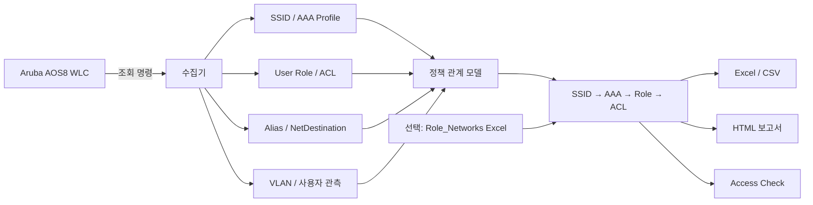
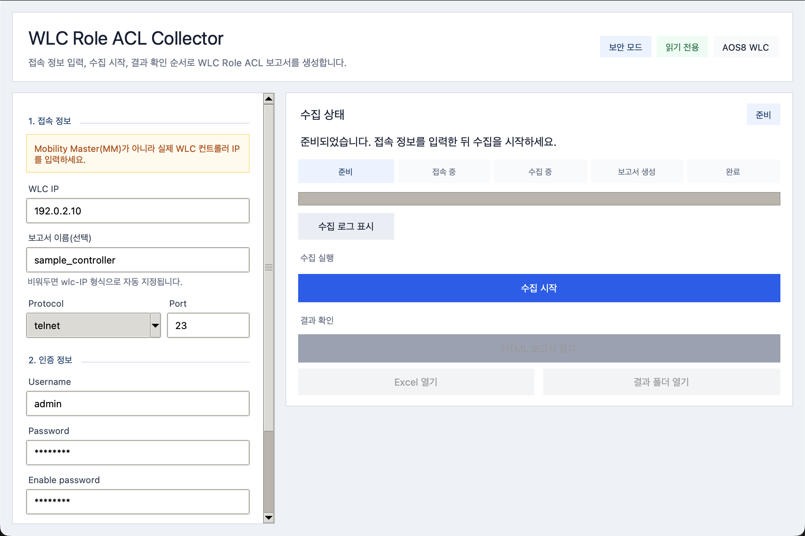
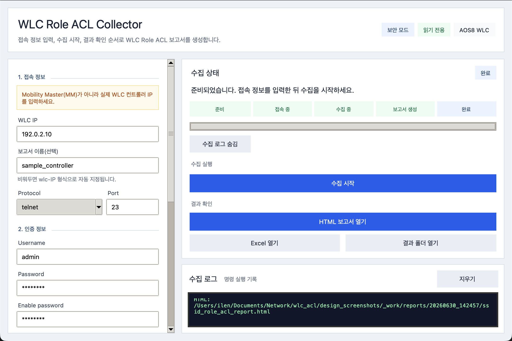
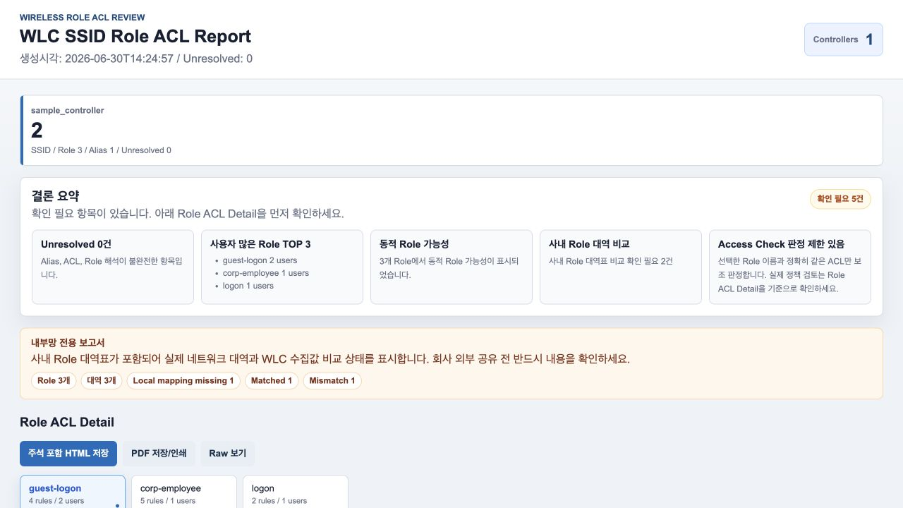
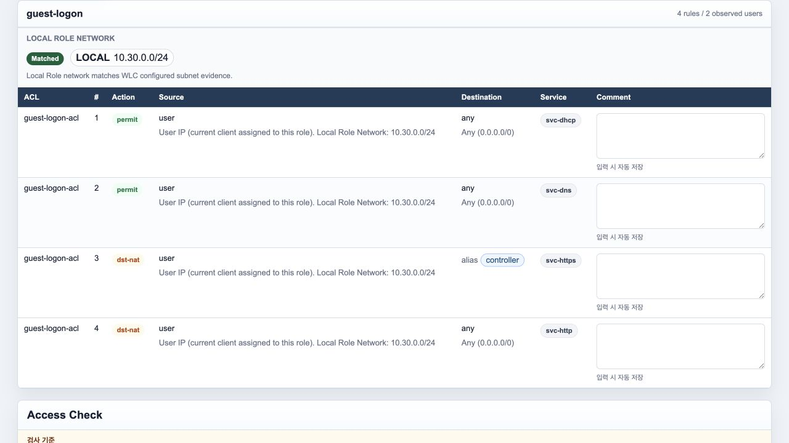
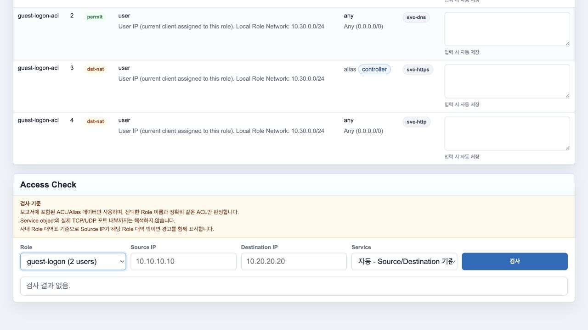

# Aruba AOS8 WLC Role / ACL 분석

**Aruba AOS8 WLC의 `SSID → AAA Profile → 기본 Role → ACL → Alias(NetDestination)` 관계를 자동 수집·구조화하고 Excel/HTML 보고서로 만드는 네트워크 운영 자동화 도구입니다.**

반복적인 CLI 조회와 수작업 정책 비교를 줄이고, **무선 서비스가 어떤 기본 Role과 ACL을 거쳐 어느 네트워크 범위에 접근할 수 있는지** 운영자가 빠르게 추적할 수 있도록 설계했습니다.

> 실제 운영 데이터는 저장소에 포함하지 않습니다. 문서와 화면 예시는 비식별 샘플·Mock 데이터만 사용합니다.

## 한눈에 보기

| 항목 | 내용 |
|---|---|
| 대상 | Aruba AOS8 WLC |
| 분석 흐름 | SSID → AAA Profile → 기본 Role → ACL → Alias / NetDestination |
| 기본 Role | `initial-role`, `mac-default-role`, `dot1x-default-role` |
| 접속 | SSH 또는 Telnet |
| 장비 변경 | **없음 — 조회 중심 수집, 설정 변경 명령 사용 안 함** |
| 결과 | Excel, CSV, HTML |
| 추가 분석 | Role별 ACL 상세, Access Check, Role 대역 비교, VLAN/사용자 관측 정보 |
| 실행 방식 | Windows GUI / 로컬 Streamlit 웹앱 / CLI |
| 오프라인 운영 | Windows 통합 ZIP 제공, Python 별도 설치 불필요 |
| 검증 | Mock/fixture, 대량 데이터 회귀, Windows 패키지/통합 ZIP CI 검증 |

## 해결하려 한 운영 문제

Aruba 무선 환경에서 특정 SSID의 실제 접근 정책을 확인하려면 여러 Profile과 Role, ACL을 연속해서 따라가야 합니다.

- SSID와 AAA Profile의 연결 관계를 일일이 확인해야 함
- `initial-role`, `mac-default-role`, `dot1x-default-role`이 서로 달라 정책 해석이 복잡함
- User Role에서 ACL 이름만 확인해도 실제 목적지 범위는 Alias/NetDestination을 다시 조회해야 함
- ClearPass/RADIUS가 동적 Role을 반환하는 환경에서는 WLC의 기본 Role만 보고 실제 적용 Role을 단정하면 안 됨
- 일부 명령 수집이 실패했을 때 나머지 정상 결과까지 사용할 수 없는 것처럼 보이거나, 반대로 불완전한 결과를 정상으로 오판할 수 있음
- CLI 출력과 Excel을 수작업으로 비교하면 누락·복사 오류가 발생하기 쉬움

이 프로젝트는 단순 명령 수집보다 **정책 관계를 연결하고, 수집 신뢰도와 분석 한계를 함께 표시하는 것**을 목표로 합니다.

## 핵심 설계 판단

| 운영 문제 | 설계 판단 |
|---|---|
| SSID 정책 경로가 여러 객체로 분산 | SSID → AAA → Role → ACL 관계를 하나의 모델로 연결 |
| 기본 Role 종류가 여러 개 | `initial/mac-default/dot1x-default`를 구분해 보고서에 각각 표시 |
| ACL의 Alias만으로 실제 범위를 알 수 없음 | Alias를 NetDestination 정의까지 추적해 네트워크 범위와 함께 정리 |
| 동적 Role을 기본 Role로 오인할 위험 | ClearPass/RADIUS 동적 Role은 **가능성**으로 분리하고 직접 수집한 값처럼 표시하지 않음 |
| 일부 명령 실패 시 결과 신뢰도 판단 필요 | `정상 완료 / 부분 완료 / 수집 실패` 상태와 영향 Role/SSID를 함께 계산 |
| 불완전한 Alias/ACL에서 잘못된 접근 허용 판정 위험 | 선행 정보가 부족하면 Access Check를 억지로 통과시키지 않고 `판정 불가`로 중단 |
| 동일 작업을 반복할 때 사람이 Excel을 다시 정리 | Excel/CSV/HTML을 동일 수집 모델에서 자동 생성 |
| 내부 Role 대역표와 WLC 추정값 비교 필요 | 선택적으로 `Role_Networks` Excel을 읽어 로컬 기준과 수집값 비교 |
| 현장 장애 재현 시 운영 정보 공유가 어려움 | IP·계정·원문을 제거한 안전 진단 보고서와 안정 오류 코드 사용 |

## 분석 구조



핵심 분석 경로는 다음과 같습니다.

```text
SSID
 ↓
AAA Profile
 ↓
initial / mac-default / dot1x-default Role
 ↓
Role에 연결된 ACL
 ↓
ACL Rule
 ↓
Alias가 있으면 NetDestination 실제 범위
 ↓
Excel / HTML / Access Check
```

## 분석 경계

정확한 결과를 위해 **수집한 사실과 추정 가능한 범위를 구분**합니다.

- ClearPass/RADIUS 서버에서 동적 Role을 직접 조회하지 않습니다.
- RADIUS 연계가 확인되는 경우 `동적 Role 가능성`으로 표시합니다.
- service object를 TCP/UDP 포트 번호까지 완전 해석하는 기능은 현재 범위가 아닙니다.
- 수집 실패가 있으면 영향을 받는 Role/SSID와 신뢰도를 결과에 표시합니다.
- Access Check는 필요한 선행 정보가 부족하면 허용/차단을 임의 추정하지 않습니다.

## 실행 및 결과 화면

아래 이미지는 저장소의 **디자인 검토용 비식별 샘플 화면**입니다. 실제 운영망 주소·계정·설정 원문은 포함하지 않습니다.

### 접속 정보 입력



### 수집 완료



### HTML 보고서 요약



### Role / ACL 상세 분석



### Access Check



전체 화면 묶음은 [`design_screenshots/`](design_screenshots/)에서 확인할 수 있습니다.

## 주요 결과물

수집이 끝나면 날짜시간과 세션 구분값을 사용해 결과 파일을 생성합니다.

```text
wlc_role_acl_<세션>.xlsx
wlc_role_acl_<세션>_ssid_role_map.csv
wlc_role_acl_<세션>.html
```

### Excel / CSV

- SSID와 AAA Profile 관계
- 기본 Role 종류별 매핑
- Role과 ACL 관계
- Alias / NetDestination 범위
- 선택적 Role 대역 비교
- 수집 상태와 영향 범위

### HTML

- 관리자 요약
- SSID / Role 관계
- Role별 ACL 상세
- ACL 주석 및 Role 설명
- 선택 Role PNG 저장
- Access Check
- 부분 수집 시 영향 Role/SSID와 권장 조치

## 안전 및 운영 원칙

- 장비 계정과 비밀번호를 코드에 저장하지 않습니다.
- 원격 웹앱 공개를 기본값으로 사용하지 않습니다. Streamlit 기본 주소는 `127.0.0.1`입니다.
- GUI/Web/CLI에서 실제 WLC 수집과 테스트 fixture를 분리합니다.
- Raw 장비 출력과 내부 Role 대역표는 공개 저장소에 포함하지 않습니다.
- 안전 진단 결과는 주소·계정·Role/ACL 원문 등 운영 정보를 마스킹합니다.
- GUI 작업 취소와 종료 시 장비 세션을 정리하도록 설계했습니다.
- 전체 live 수집에는 60분 상한을 두고 명령 Timeout은 5~600초 범위로 제한합니다.

상세 보안 경계는 [보안 모델](docs/SECURITY_MODEL_KO.md), 현장 진단은 [진단 모드 안내](docs/DIAGNOSTIC_MODE_KO.md)를 참고하십시오.

## 검증

자동 검증과 실제 운영 검증은 같은 의미로 취급하지 않습니다.

| 검증 항목 | 상태 |
|---|---|
| Parser / ACL 평가 단위 테스트 | ✅ 자동 검증 |
| Mock WLC / fixture 기반 수집 | ✅ 자동 검증 |
| GUI / CLI / Web 공통 상태 모델 | ✅ 자동 검증 |
| 60 Role / 1,200 ACL 회귀 | ✅ 자동 검증 |
| 100 Role / 4,000 ACL HTML 렌더링 경로 | ✅ 검증 항목 포함 |
| Windows GUI/CLI 패키지 | ✅ GitHub Actions |
| Streamlit portable 패키지 | ✅ GitHub Actions |
| GUI + Web 통합 ZIP | ✅ GitHub Actions |
| 실제 운영 환경 결과 | 공개 자료에서는 민감정보를 제거한 검증 요약만 관리 |

구체적인 검증 항목과 공개 가능한 증거 범위는 [검증 보고서](docs/VALIDATION_REPORT.md)에 정리합니다.

## 빠른 시작

일반 사용자는 GitHub **Releases**의 Windows 통합 ZIP을 사용합니다.

```text
wlc-role-acl-collector_vYYYY.MM.DD-HHMMSS_windows.zip
```

압축을 완전히 푼 뒤 목적에 맞는 실행 경로를 선택합니다.

### Windows GUI

```text
gui\WlcRoleAclCollectorGUI.exe
```

권장 흐름:

1. WLC 주소와 SSH/Telnet 접속 정보를 입력합니다.
2. 필요한 경우 Enable password와 Role 대역표 Excel을 지정합니다.
3. `분석 시작`을 실행합니다.
4. `정상 완료 / 부분 완료 / 수집 실패` 상태를 확인합니다.
5. HTML/Excel 결과에서 SSID → Role → ACL 관계를 확인합니다.

### 로컬 웹앱

```text
web\start_webapp.cmd
```

기본 접속 주소:

```text
http://127.0.0.1:8763
```

원격 접속은 TLS·인증·접근통제가 별도로 승인된 환경에서만 구성하십시오.

더 자세한 실행 절차는 [사용자 가이드](docs/USER_GUIDE_KO.md)를 참고하십시오.

## 개발 및 검증

Python 3.11 이상에서:

```powershell
python -m pip install -e ".[dev]"
python -m pytest
powershell -NoProfile -ExecutionPolicy Bypass -File .\tools\validate.ps1
```

Windows 통합 패키지는 GitHub Actions 또는 Windows 환경에서 검증합니다.

개발 구조와 변경 원칙은 [`DEVELOPMENT.md`](DEVELOPMENT.md), 세부 모듈 설명은 [개발자 가이드](docs/DEVELOPER_GUIDE_KO.md)를 참고하십시오.

## 문서

| 문서 | 용도 |
|---|---|
| [사용자 가이드](docs/USER_GUIDE_KO.md) | 설치·실행·결과 확인 |
| [개발자 가이드](docs/DEVELOPER_GUIDE_KO.md) | 모듈 구조와 개발 흐름 |
| [검증 보고서](docs/VALIDATION_REPORT.md) | 자동/운영 검증 경계와 체크리스트 |
| [보안 모델](docs/SECURITY_MODEL_KO.md) | 민감정보·접근·진단 경계 |
| [오류 코드](docs/ERROR_CODES_KO.md) | 오류 의미와 1차 조치 |
| [진단 모드](docs/DIAGNOSTIC_MODE_KO.md) | 비식별 현장 진단 |
| [Release 운영](RELEASE_NOTES.md) | 배포 기준과 산출물 계약 |
| [변경 이력](CHANGELOG.md) | 기능 변경 기록 |

## 현재 제외 범위

- ClearPass/RADIUS 서버에서 동적 Role 직접 조회
- service object의 모든 TCP/UDP 포트 정밀 해석
- Streamlit 자체 사용자 로그인/권한 관리
- 코드서명 / installer / MSIX
- macOS에서 Windows EXE를 직접 생성하는 공식 빌드 경로

이 저장소의 목적은 **Aruba 정책 객체를 많이 수집하는 것 자체가 아니라, 무선 서비스와 접근 제어 정책의 관계를 운영자가 추적 가능한 형태로 만드는 것**입니다.
