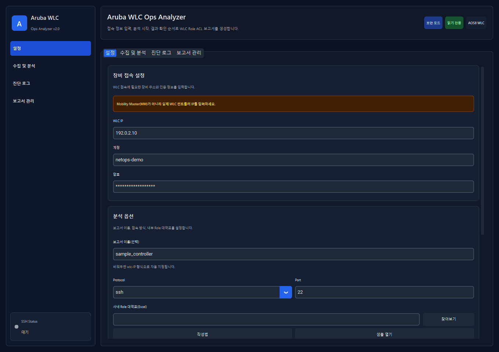
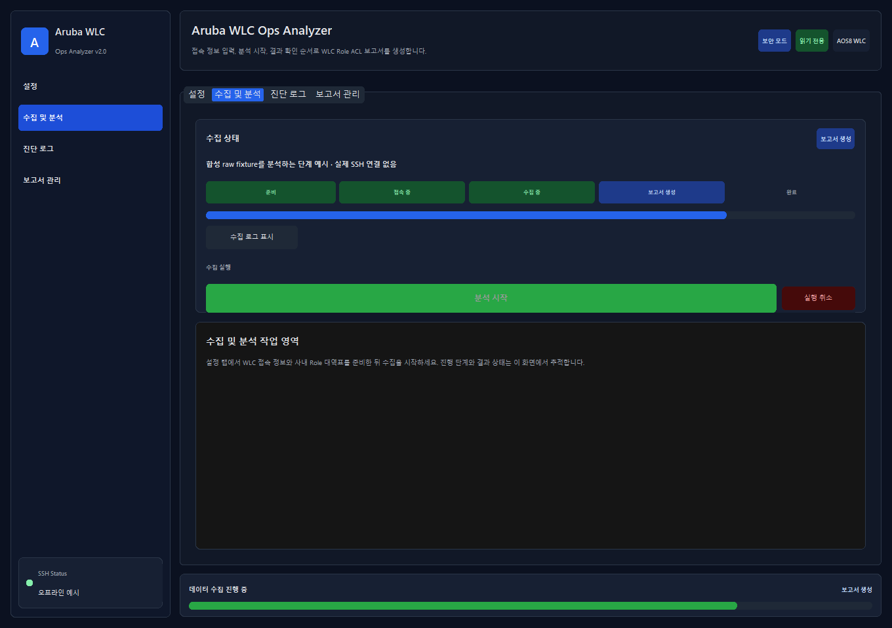
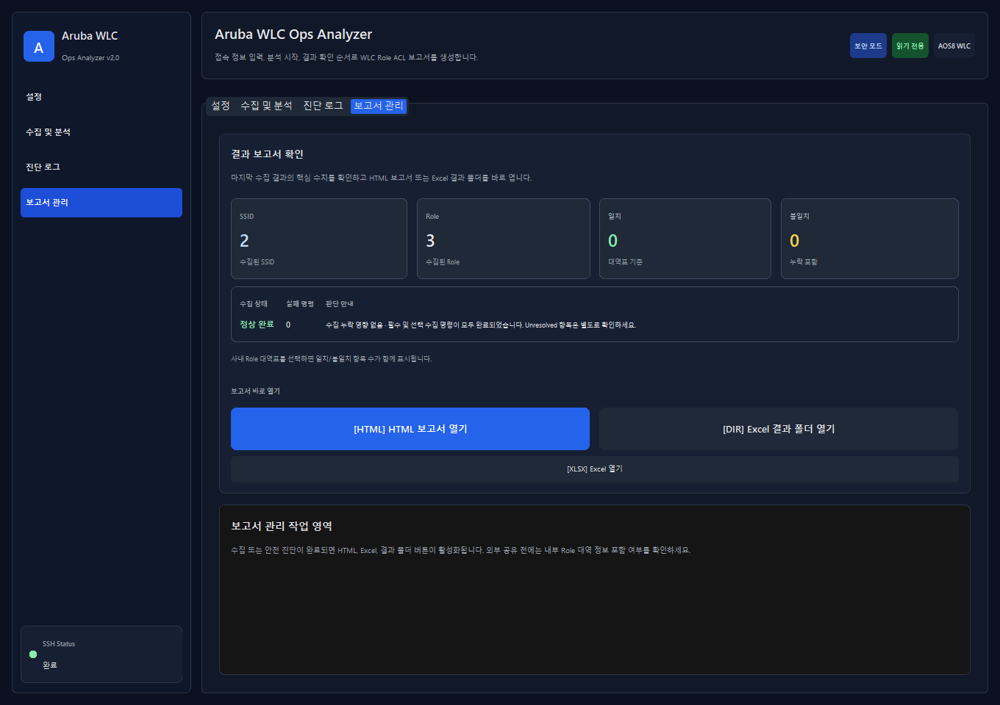
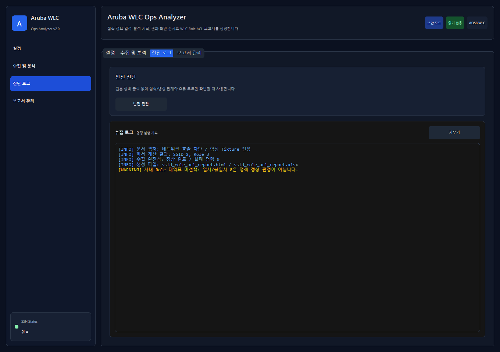

# 화면으로 따라가는 WLC 정책 수집·해석

현재 CustomTkinter 앱 창을 Windows에서 캡처했다. 설정·분석 단계는 합성 상태를 주입했고, 보고서 요약은 체크인된 `tests/fixtures/sample_controller`를 실제 오프라인 수집기·파서·보고서 생성기로 처리한 값이다. SSH 연결이나 실장비 수집은 하지 않았다.

## 1. 접속·분석·출력 설정 확인

- **행동:** 설정에서 장비 이름·주소, SSH/포트, 계정, 결과 폴더를 확인한다. 역할 대역 비교가 필요하면 승인된 Role 대역표를 선택한다. 설정 영역을 아래로 스크롤해 출력 폴더와 나머지 실행 옵션까지 확인한다.
- **읽을 값:** `sample_controller`, `192.0.2.10`, SSH/22는 문서용 합성 입력이다.
- **주의·다음 행동:** 역할 대역표가 없으면 일치/불일치 집계만 보고 정상이라고 결론 내릴 수 없다. 실제 수집 전에는 장비 관리자와 대상·읽기 권한·SSH 신뢰 설정을 확인한다.

## 2. 단계와 전체 상태를 함께 읽기

- **행동:** 수집 및 분석 화면에서 현재 단계와 안내를 읽는다.
- **읽을 값:** 그림은 `보고서 생성` 단계 예시이고, 연결 상태도 `오프라인 예시`로 구분했다.
- **주의·다음 행동:** 단계 진행만으로 모든 명령이 수집되었다고 보지 않는다. 실제 실행에서는 오류·취소·부분 완료 여부를 확인하고 결과 화면의 완전성 정보로 이어간다.

## 3. 결과 건수보다 수집 완전성 먼저 확인

- **행동:** 보고서 관리에서 수집 상태·실패 명령·SSID/Role 집계·안내를 확인한다.
- **읽을 값:** 합성 fixture의 계산 결과는 SSID 2개, Role 3개, 실패 명령 0개다. Role 대역표를 선택하지 않아 일치/불일치가 0으로 표시된다.
- **주의·다음 행동:** 일치/불일치 0은 정책 정상 판정이 아니다. HTML에서 SSID→Role→ACL 근거와 Unresolved 항목을 확인하고, 실제 사용자 경로·인증·NAT 등 수집 범위 밖 조건과 구분한다. 캡처 중에는 파일 열기 버튼을 실행하지 않았다.

## 4. 로그와 산출물을 연결

- **행동:** 진단 로그에서 실행 범위와 문제를 확인하고 해당 실행 폴더의 `report_status.json`, HTML, XLSX와 대조한다.
- **읽을 값:** 이 그림의 로그는 공개용 설명 이벤트이며 경로·계정·실제 원문을 포함하지 않는다. SSID·Role·완전성 숫자는 실제 fixture 계산값을 사용했다.
- **주의·다음 행동:** 오류가 있으면 해당 실행의 로그와 수집 완전성 정보를 먼저 확인한다. [사용자 가이드](USER_GUIDE_KO.md), [오류 코드](ERROR_CODES_KO.md)의 해석 절차를 따른다.

## 캡처 출처와 재현

- 패키지 버전: `0.2.0`. 창 제목의 `Aruba WLC Ops Analyzer v2.0`은 현재 UI 제목이며 패키지 버전과 별개다.
- 캡처 OS: Windows GitHub Actions/Python 3.11, 실제 CustomTkinter 창의 PrintWindow 캡처.
- 캡처 소스 SHA: `522b6da3bb1b38aa8cb6a6381805ac4e112e024e`. [Windows 캡처 실행](https://github.com/sebia1993/aruba-wireless-policy-mapper/actions/runs/34176520732).
- 전체 메타데이터와 PNG SHA-256: [capture-manifest.json](images/capture-manifest.json).
- 도구: [capture_usage_screenshots.py](../tools/capture_usage_screenshots.py), [창 캡처 helper](../tools/capture_windows.py), [Windows workflow](../.github/workflows/docs-screenshots.yml). Pillow 설치는 캡처 workflow에서 관리한다.
- 소켓 연결 차단, 임시 출력 폴더, 합성 주소·계정만 사용한다. 분석·보고서 생성에는 실제 `collect_from_offline_raw`→파서→`write_reports`를 사용한다.

Windows에서 잠금 의존성과 캡처용 Pillow 설치 후 `python tools/capture_usage_screenshots.py --output artifacts/docs-screenshots`로 재현한다. macOS에서 장비 없이 계산 결과를 검증하려면 [포트폴리오 검토 안내](PORTFOLIO_REVIEW_KO.md)의 offline 명령을 사용한다. Windows GUI·패키지 검증은 기존 CI와 별도로 확인한다.

이전 `design_screenshots` 갤러리는 2026-06-30 시점의 legacy 화면이다. 현재 앱 사용 방법은 이 문서를 기준으로 삼는다. 합성 화면은 회사 WLAN·현장 정책 검증 결과가 아니다.
